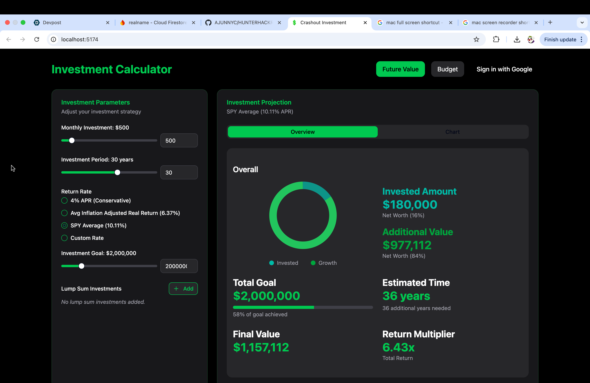
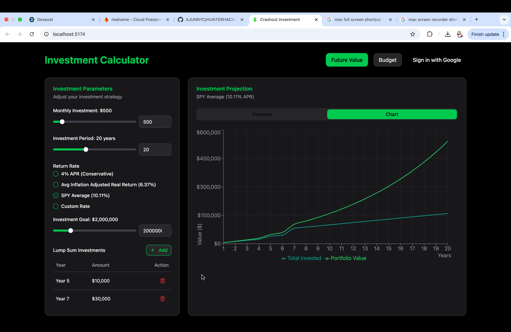
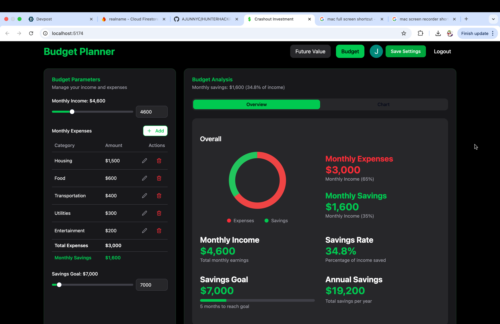
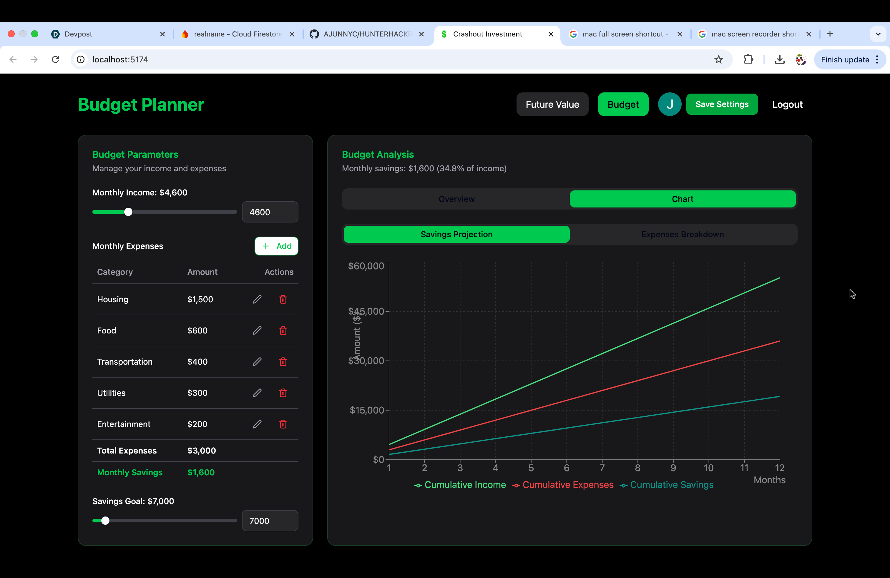
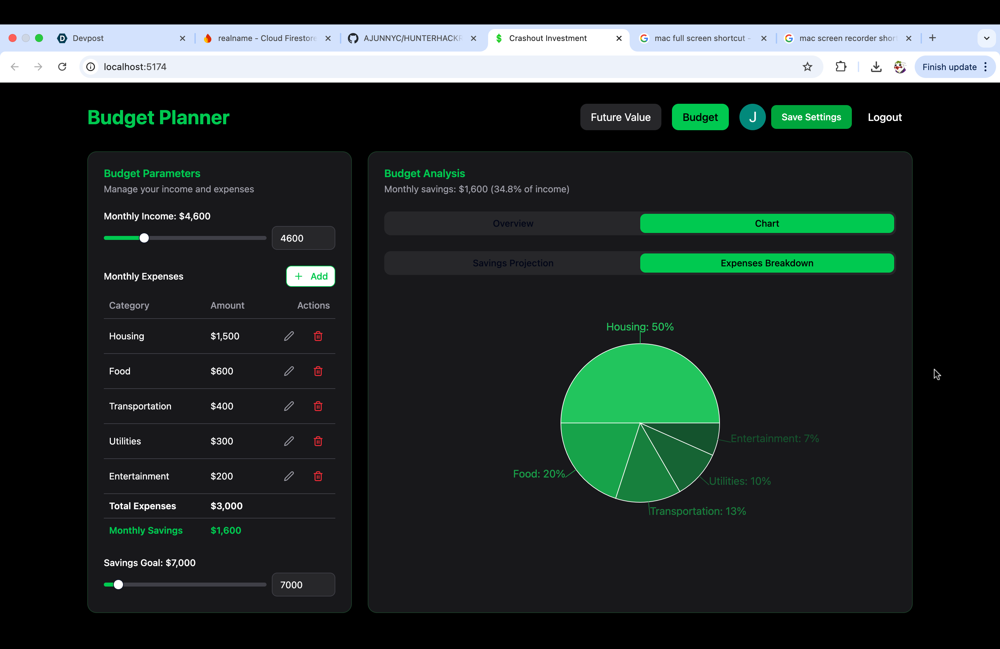

# Crashout Investment 

A short hackathon project where my goal was to teach a freshman how to make a fullstack project.
Here we made a simple investment project using React + Vite with Tailwind CSS and Shadcn UI componenets, firebase was used for everything in the backend.

---

## 📸 Demo Preview

📽️ Watch the full demo: [Demo](https://www.youtube.com/watch?v=m8QUZokmU1o)

